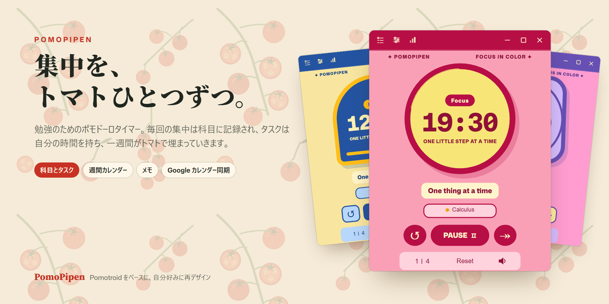
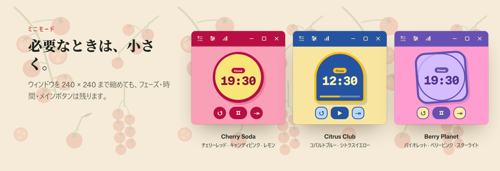

<p align="center">
  
</p>

<p align="center">
  <a href="README.md">English</a> · <a href="README.zh-CN.md">简体中文</a> · <b>日本語</b>
</p>

PomoPipen は、自分の勉強のために作ったポモドーロタイマーです。Christopher Murphy（Splode）さんの
[**Pomotroid**](https://github.com/Splode/pomotroid) のフォークとして始まりました。信頼できるタイマーの
仕組みはそのままに、画面を自分好みにデザインし直し、勉強に必要だった機能（科目、タスク、週間カレンダー、
メモ、Google カレンダー同期）を加えています。

- **対応環境：** いまは Windows（x64）のみ。macOS や Linux への移植は大歓迎です（[対応環境](#対応環境) を参照）。
- **すべての機能：** [機能一覧](#すべての機能) をご覧ください。

> [!NOTE]
> PomoPipen は個人のプロジェクトで、Pomotroid 公式とは関係ありません。
> 元のアプリの功績はすべて [Pomotroid](https://github.com/Splode/pomotroid)（MIT ライセンス）にあります。

> [!TIP]
> アプリの画面は英語と簡体字中国語のみです。下のスクリーンショットは英語版です。

## Pomotroid との違い

| | Pomotroid | PomoPipen |
|---|---|---|
| **見た目** | ひとつの文字盤に 38 の配色 | デザインし直した 4 つのテーマ。文字盤・書体・背景柄がテーマごとに違う |
| **科目** | — | 集中した時間は、そのとき勉強していた科目に記録 |
| **タスク** | — | 科目ごとの ToDo リスト。見積もり時間と実際の時間を比較 |
| **統計** | 日・週・52 週のヒートマップ | 概要、手で編集できる週間カレンダー、年間ヒートマップ、科目別合計、推移グラフ |
| **途中で止めた回** | 数えない | スキップやリセットした回も 1 分以上なら学習時間に加算。進捗は 1 分ごとに保存 |
| **ふと浮かんだこと** | — | メモ：いま書き留めて、休憩中に片づける |
| **カレンダー** | — | Google カレンダーへの一方向同期（任意） |
| **データの安全** | — | 起動のたびにデータベースのスナップショットを保存 |

## 一週間を、トマトで

<p align="center"></p>

週間カレンダーには、実際に集中した時間が並びます。ブロックは本当の開始時刻から始まり、続けた時間の分だけ
高くなります。同じ科目の連続した回はひとつのブロックにまとまります（`×3` は 3 回分）。ブロックをドラッグ
すると時間を移動、下端をドラッグすると長さを変更、空いているところをダブルクリックすると計り忘れた回を追加
できます。Classic Tomato テーマでは、科目ごとに違う品種のトマトが八百屋のかごに詰まっています。週の始まりは
日曜・月曜から選べます。

## 統計

<p align="center"></p>

年間ヒートマップ、合計回数と合計時間、最長連続日数、科目別の時間、そして 30 日・90 日・1 年の日ごとの推移
（7・14・30 日平均線つき）。どの画面も科目で絞り込めます。

## 科目を知っているタスク

<p align="center"></p>

タスクは所属する科目の下に並びます。星をつけたタスクが「いまのタスク」になり、集中した時間がそこに記録される
ので、見積もりと実際にかかった時間を比べられます。終わったタスクは自動でしまわれ、元に戻すこともできます。

## メモ：書き留めて、集中を続ける

<p align="center"></p>

集中の途中で何か思いついたら、タイマーで <kbd>N</kbd> を押すか、吹き出しボタンを押すか、どのアプリからでも
グローバルショートカット <kbd>Ctrl</kbd>+<kbd>Alt</kbd>+<kbd>N</kbd> で書き留めて、すぐ勉強に戻れます。
タイマーは止まりません。集中しているあいだ、メモは紙の束にたたまれて邪魔をしません。休憩が始まると一度だけ
お知らせが出るので、ひとつずつ消すか、タスクに変えられます。

## 4 つのテーマと、ミニモード

<p align="center"></p>

Classic Tomato（標準）、Cherry Soda、Citrus Club、Berry Planet。テーマを切り替えても、進行中の回は止まり
ません。タイマーとカレンダーの背景画像はテーマごとに保存されます。ウィンドウを 240 × 240 まで縮めても、
フェーズ・時間・メインボタンは残ります。

Classic Tomato のタイマーは、目盛りが本当に回る機械式のキッチンタイマー（目盛りをひねって時間を設定）か、
カウントダウンの輪の中の本物のトマトです。正式な画像がまだできていないため、ここでは載せていません。

## Google カレンダー同期（任意）

<p align="center"></p>

終わった集中時間は、アプリが Google アカウントに作る専用の「PomoPipen study log」カレンダーに一方向で書き込まれ
ます。PomoPipen が見たり変えたりできるのは、そのカレンダーだけです。同じ科目の連続した回はひとつの予定に
まとまり、送られるのは科目名・時間・タスク名だけです。詳しくは [PRIVACY.md](PRIVACY.md) をご覧ください。

使うには、Google Cloud で自分の OAuth クライアント（デスクトップアプリ）を作り、その JSON ファイルを
設定 → Calendar sync で読み込みます。手順は [docs/GOOGLE_CALENDAR.md](docs/GOOGLE_CALENDAR.md)（中国語）にあります。

## すべての機能

### タイマー
- ポモドーロのサイクル：集中・短い休憩・長い休憩の長さと、長い休憩までの回数を調整できます
- 次の集中や休憩を自動で開始。短い休憩・長い休憩をまるごとオフにすることも可能
- 一時停止、再開、やり直し、スキップ、リセット
- 長さはタイマーの上で直接設定：Classic Tomato の目盛りをひねる、矢印キー、または分数を入力（`30` や `25:30`、1〜90 分）
- 途中で止めた回も数える：スキップやリセットした集中も、1 分以上なら学習時間・カレンダー・グラフ・タスクの時間・連続日数に加算
- 進捗は 1 分ごとに保存。途中でアプリを終了しても失うのは 1 分未満
- タイマーの下に今日のトマトの数
- ミニモード：ウィンドウを 240 × 240 まで縮小
- 最前面表示（休憩中だけ解除することも可能）
- メインボタンのクリック音。オフにしたり、好きな音に変えたりできます

### 科目
- 集中した回はすべて科目に記録。いまの科目はタイマーの上で切り替え
- 科目の色は現在のテーマのパレットから。名前の変更、並べ替え、アーカイブ、削除
- Classic Tomato：科目ごとにトマトの品種。「いちばん近い品種に切り替える」をワンクリックで（プレビューと取り消しつき）

### タスク（ToDo リスト）
- 科目ごと（と「未分類」）にまとめて表示
- 見積もり時間と実際の集中時間を並べて表示
- 星をつけたタスクが「いまのタスク」になり、集中時間が記録されます
- 完了は取り消し可能。終わったタスクは自動でしまわれます

### メモ（集中中の書き留め）
- <kbd>N</kbd>、タイトルバーの吹き出しボタン、またはグローバルショートカット <kbd>Ctrl</kbd>+<kbd>Alt</kbd>+<kbd>N</kbd> で開く
- グローバルショートカットはタイマーを前面に出し、書き終わると元に戻します
- 集中中は紙の束にたたまれ、休憩が始まると一度だけお知らせ
- 消す、編集、削除（取り消し可能）、または好きな科目のタスクに変換
- 書いた時刻、集中中だったか、そのときの科目を覚えています

### 週間カレンダー
- 集中ブロックを実際の時刻と長さで表示。同じ科目の連続した回はひとつのブロックに（`×N`）
- ブロックをドラッグして時間を移動（別の日へも）、下端をドラッグして長さを変更
- 空いているところをドラッグかダブルクリックで、計り忘れた回を追加。ブロックをクリックすると日付・時刻・科目・タスクを編集、または削除。すべて取り消し可能
- 途中で止めた回は薄い色で表示
- 週の始まりは日曜か月曜。24 時間表示
- Classic Tomato：ブロックは科目の品種のトマトになり、透明度を調整できるトマトかごの枠に収まります

### 統計
- 概要：今日の回数、集中時間、完了率、直近 7 日、現在の連続日数、時間帯ごとの集中
- グラフ：GitHub 風の年間ヒートマップ、合計回数、合計集中時間、最長連続日数、科目別の時間
- 1 日・1 週間・1 か月の科目円グラフ
- 30 日・90 日・1 年の日ごとの学習時間（7・14・30 日平均線つき）
- 科目で絞り込み
- 統計ウィンドウはサイズ変更・拡大縮小可能（<kbd>Ctrl</kbd> + マウスホイール、<kbd>Ctrl</kbd> <kbd>+</kbd> / <kbd>−</kbd> / <kbd>0</kbd>）

### テーマと見た目
- 4 つのテーマ：Classic Tomato、Cherry Soda、Citrus Club、Berry Planet。切り替えても進行中の回は止まりません
- Classic Tomato のタイマーは 2 種類：目盛りが回る機械式キッチンタイマー、またはカウントダウンの輪の中の本物のトマト
- タイマーとカレンダーにそれぞれ好きな背景画像（JPG・PNG・WebP）をテーマごとに設定。透明度、「写真で埋める」か「柄を並べる」、柄の大きさ
- 継ぎ目のない並べ方：柄の繰り返しを自動で見つけるので、どこで切った柄でも継ぎ目が出ません
- Classic Tomato のページ背景：つるのトマト、品種図鑑、無地の紙
- 好きな画像でアプリのアイコンを変更
- アニメーションは OS の「視覚効果を減らす」設定に従います

### Google カレンダー同期（任意）
- 専用の「PomoPipen study log」カレンダーへの一方向同期。アプリが触れるのはそのカレンダーだけ（`calendar.app.created` スコープ）
- 集中が終わって約 20 秒後と起動時に自動同期。「今すぐ同期」も可能
- 同じ科目の連続した回はひとつの予定になり、説明欄に回数とタスクが入ります
- 直近 14 日の編集・削除も反映
- システムのプロキシを使い、接続に失敗したら自動で再試行

### 通知とサウンド
- 回が終わるとデスクトップ通知
- 集中・短い休憩・長い休憩の通知音。それぞれ好きな音声ファイルに変更可能
- 集中中・休憩中のチクタク音（任意）と音量調整

### キーボードショートカット
- グローバルショートカット（ウィンドウが隠れていても使える）：開始/一時停止、リセット、スキップ、やり直し、メモ
- ローカルショートカット：一時停止/再開、リセット、スキップ、音量の上げ下げ、ミュート、全画面、メモ
- 新しいキーを押すだけで割り当てを変更。保存前に重複を警告

### システムとデータ
- 進み具合の弧がリアルタイムに動くトレイアイコン。最小化・閉じるでトレイへ
- データはすべてローカルの SQLite データベースに保存
- 起動のたびにデータベースのスナップショットを自動作成（直近 10 回分と、30 日分の 1 日 1 つ）
- 配信オーバーレイなどの外部連携用のローカル WebSocket サーバー（任意）
- ログファイル。「ログフォルダーを開く」と詳細ログモード
- 画面は英語と簡体字中国語。Pomotroid のスペイン語・フランス語・ドイツ語・日本語・ポルトガル語・トルコ語の翻訳も残っていますが、元の画面にしか対応していません

## 対応環境

PomoPipen はいまのところ **Windows（x64）** のみに対応しています。ビルドとテストも Windows でしか行っていません。
Pomotroid と同じく [Tauri 2](https://tauri.app) 製で、Pomotroid は macOS や Linux でも動くので、移植はできるはず
です。ぜひソースをフォークして、自分の環境に合わせてみてください。動いたら、プルリクエストも大歓迎です。

## ソースからビルド

[Node.js 22](https://nodejs.org)、[Rust](https://rustup.rs)、
[Tauri 2 の前提条件](https://v2.tauri.app/start/prerequisites/) が必要です。

```bash
npm install
npm run tauri -- build --no-bundle --config src-tauri/tauri.stable.conf.json
```

アプリは `src-tauri/target/release/pomopipen.exe` にできます。`npm run tauri dev` や `npm run tauri build`
をそのまま実行すると、別のデータを使う「PomoPipen Dev」版になります。

> [!IMPORTANT]
> Classic Tomato のタイマーに使っている写真は仮のものなので、このリポジトリには含めていません。正式な画像が
> 入るまで、ソースからビルドするとこのタイマーは画像なしで表示されます。設定 → Appearance で Cherry Soda、
> Citrus Club、Berry Planet のどれかを選んでください。

Google カレンダー同期を使う場合は、ビルド前に OAuth クライアントの JSON を `src-tauri/google/client.json` に
置くこともできます（git では無視されます）。

## プライバシー

学習の記録は自分のパソコンの中だけ（アプリのデータフォルダーにある SQLite データベース）に保存されます。
PomoPipen にはテレメトリーもサーバーもありません。パソコンの外に出るのは、[PRIVACY.md](PRIVACY.md) で説明
している任意の Google カレンダー同期だけです。

## クレジット

- [Pomotroid](https://github.com/Splode/pomotroid)：作者 Christopher Murphy（Splode）。PomoPipen のもとになったアプリです（MIT）。
- [Tauri 2](https://tauri.app)、[Rust](https://www.rust-lang.org)、[Svelte 5](https://svelte.dev) で作っています。
- フォント：Mona Sans（GitHub）、Source Serif 4 と Source Han Serif（Adobe）、Noto Serif SC（Google）。いずれも SIL Open Font License 1.1 です。[static/fonts/LICENSE.txt](static/fonts/LICENSE.txt) を参照してください。

## ライセンス

[MIT](LICENSE)。Pomotroid の元の著作権表示はそのまま残しています。PomoPipen の変更も同じライセンスで公開します。
