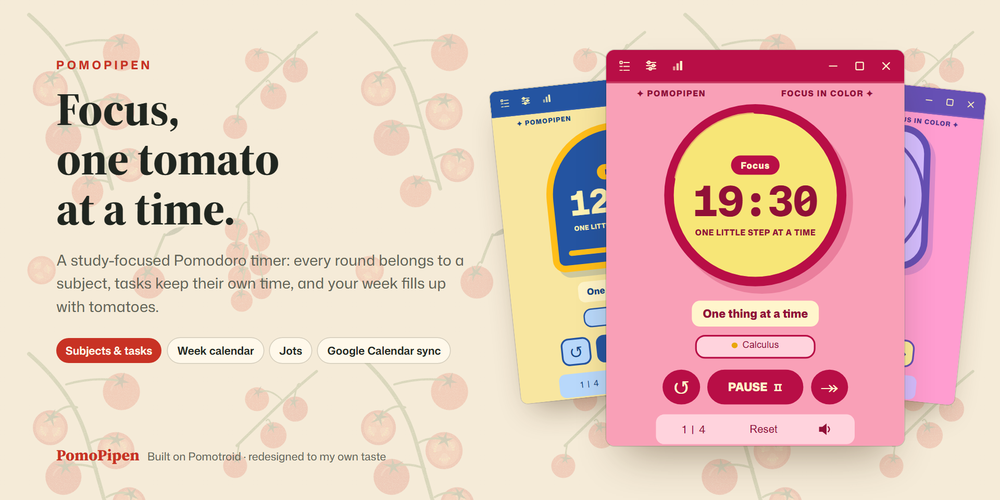
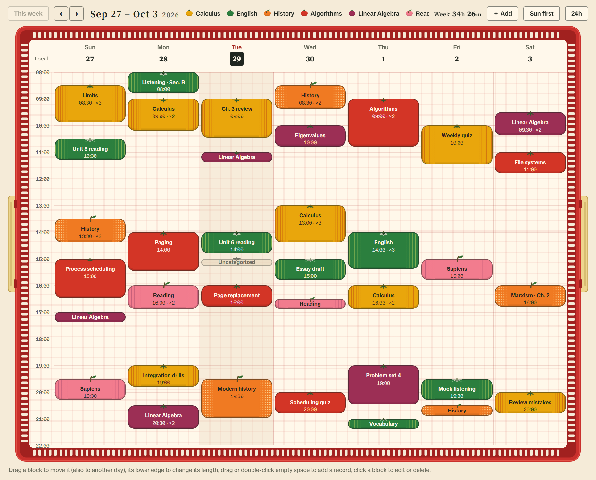
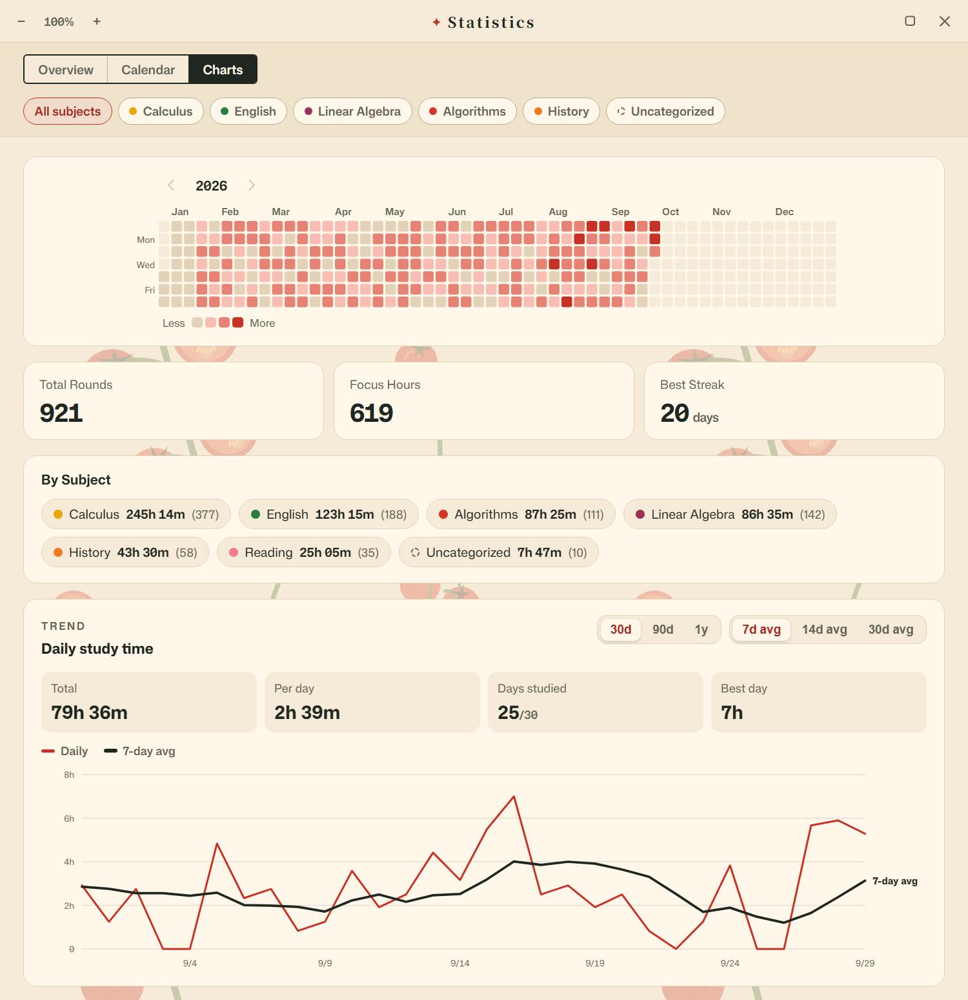
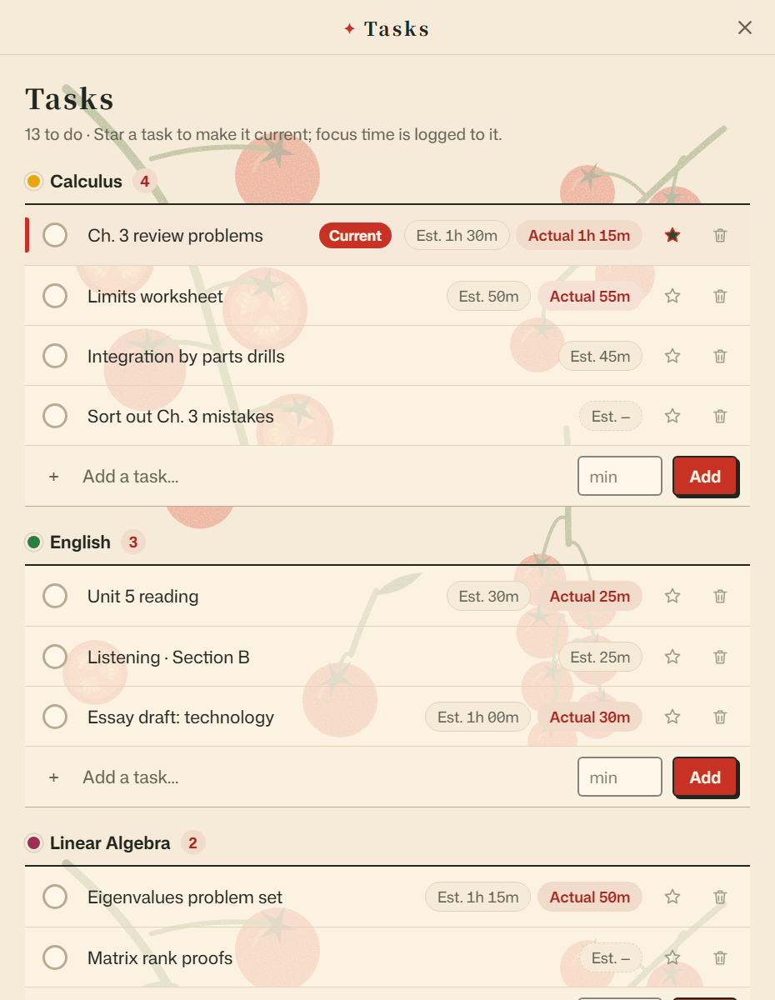
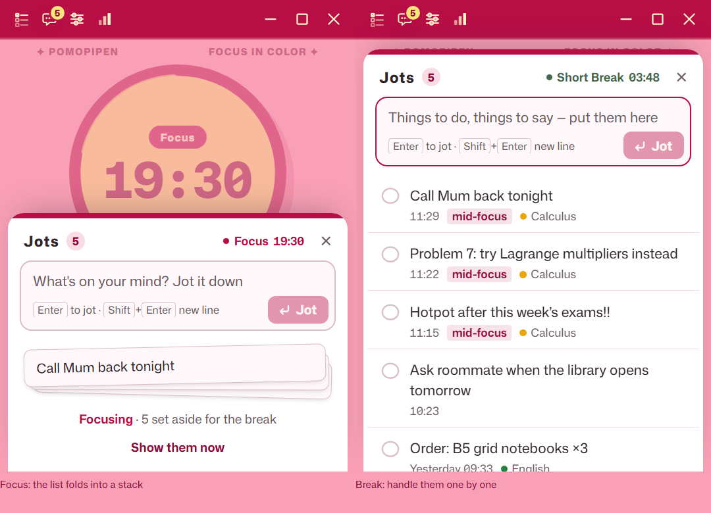
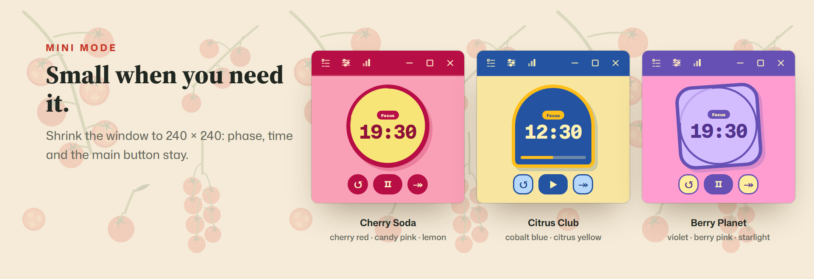
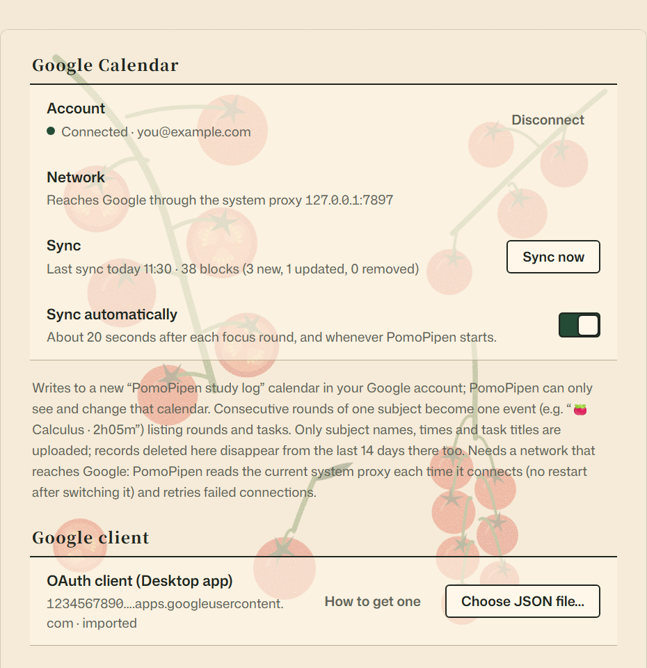

<p align="center">
  
</p>

<p align="center">
  <b>English</b> · <a href="README.zh-CN.md">简体中文</a> · <a href="README.ja.md">日本語</a>
</p>

PomoPipen is a Pomodoro timer I built for studying. It started as a fork of
[**Pomotroid**](https://github.com/Splode/pomotroid) by Christopher Murphy (Splode):
I kept its reliable timer engine, redesigned the interface to my own taste,
and added the features I was missing: subjects, a to-do list, a week calendar,
quick jots and Google Calendar sync.

- **Platform:** Windows (x64) for now. Ports to macOS and Linux are welcome (see [Platform](#platform)).
- **All features:** see the [full list](#all-features).

> [!NOTE]
> PomoPipen is a personal project and is not affiliated with Pomotroid.
> All credit for the original app goes to [Pomotroid](https://github.com/Splode/pomotroid) (MIT License).

## What's different from Pomotroid

| | Pomotroid | PomoPipen |
|---|---|---|
| **Look** | 38 color themes on one dial | 4 hand-designed themes, each with its own timer face, type and background print |
| **Subjects** | — | Every focus round is logged to what you were studying |
| **Tasks** | — | A to-do list grouped by subject, with estimated vs. actual time |
| **Statistics** | Daily, weekly and a 52-week heatmap | Overview, an editable week calendar, yearly heatmap, per-subject totals and a trend chart |
| **Interrupted rounds** | Not counted | A skipped or reset focus round still counts (from 1 minute); progress is saved every minute |
| **Stray thoughts** | — | Jots: write them down now, deal with them in the break |
| **Calendar** | — | Optional one-way sync to Google Calendar |
| **Data safety** | — | The database is snapshotted before every launch |

## Your week, in tomatoes

<p align="center"></p>

The week calendar shows the focus you actually did. Each block starts at its real
start time and is as tall as you stayed; back-to-back rounds of one subject merge
into one block (`×3` means three rounds). Drag a block to move it, drag its lower
edge to change its length, or double-click empty space to add a round you forgot
to time. In the Classic Tomato theme every subject is its own tomato variety, packed
in a produce basket. Weeks can start on Sunday or Monday.

## Statistics

<p align="center"></p>

A yearly heatmap, total rounds and hours, your best streak, time per subject, and a
daily trend over 30 days, 90 days or a year with 7-, 14- or 30-day averages. Every
view can be filtered by subject.

## Tasks that know their subject

<p align="center"></p>

Tasks live under the subject they belong to. Star one to make it current and every
focus round is logged to it, so you can compare your estimate with the time it
really took. Finished tasks tuck themselves away, with undo.

## Jots: write it down, keep focusing

<p align="center"></p>

A thought pops up in the middle of a round? Press <kbd>N</kbd> in the timer, click the
speech-bubble button, or use the global shortcut <kbd>Ctrl</kbd>+<kbd>Alt</kbd>+<kbd>N</kbd>
from any app. Write it down and go back to work; the timer never pauses. While you
focus, your jots fold into a stack so they don't pull you away. When the break
starts, PomoPipen reminds you once: cross each jot off, or turn it into a task.

## Four themes, and a mini mode

<p align="center"></p>

Classic Tomato (the default), Cherry Soda, Citrus Club and Berry Planet. Switching
themes never pauses the running round. Each theme keeps its own background pictures
for the timer and the calendar. Shrink the window to 240 × 240 and the timer keeps
the phase, the time and the main button.

In Classic Tomato the timer is a mechanical kitchen timer whose scale really turns
(twist it to set the time), or a real tomato inside a countdown ring. Its final
artwork isn't ready yet, so it isn't shown here.

## Google Calendar sync (optional)

<p align="center"></p>

Finished focus time is written, one way, to a separate "PomoPipen study log"
calendar that the app creates in your Google account. PomoPipen can only see and
change that one calendar. Back-to-back rounds of one subject become one event.
Only subject names, times and task titles are uploaded. See [PRIVACY.md](PRIVACY.md).

To use it, create your own OAuth client (Desktop app) in Google Cloud and import its
JSON file in Settings → Calendar sync. The step-by-step guide is in
[docs/GOOGLE_CALENDAR.md](docs/GOOGLE_CALENDAR.md) (in Chinese).

## All features

### Timer
- Pomodoro cycle with adjustable focus, short break and long break lengths, and the number of rounds before a long break
- Auto-start the next focus round and/or break; turn short or long breaks off entirely
- Pause, resume, restart, skip and reset a round
- Set the length right on the timer: twist the Classic Tomato scale, use the arrow keys, or type the minutes (`30` or `25:30`, 1–90 minutes)
- Unfinished rounds count: a focus round you skip or reset still adds its time (from 1 minute) to your study time, calendar, charts, task time and streak
- Progress is saved every minute, so quitting the app mid-round loses at most a minute
- Today's tomato count in the timer's footer
- Mini mode: shrink the window down to 240 × 240
- Always on top, optionally switched off during breaks
- A soft click on the main button, which you can turn off or replace with your own sound

### Subjects
- Every focus round is logged to a subject; pick the current subject right on the timer
- Subject colors come from the current theme's palette; rename, reorder, archive and delete subjects
- Classic Tomato: every subject is a tomato variety, with a one-click "switch to the closest varieties" (preview and undo)

### Tasks (to-do list)
- Tasks grouped by subject, plus Uncategorized
- Estimated time next to the actual focus time
- Star a task to make it current; focus time is logged to it
- Check tasks off with undo; finished tasks tuck themselves away

### Jots (quick notes while you focus)
- Open with <kbd>N</kbd>, the speech-bubble button in the title bar, or the global shortcut <kbd>Ctrl</kbd>+<kbd>Alt</kbd>+<kbd>N</kbd>
- The global shortcut brings the timer forward and puts it back after you jot
- During focus the list folds into a stack; when the break starts you get one reminder
- Cross jots off, edit or delete them (with undo), or turn one into a task under any subject
- Each jot remembers when it was written, whether it was mid-focus, and the subject you were on

### Week calendar
- Focus blocks at their real time and length; back-to-back rounds of one subject merge into one block (`×N`)
- Drag a block to move it (also to another day), drag its lower edge to change its length
- Drag or double-click on empty space to add a round you forgot to time; click a block to edit its date, times, subject and task, or delete it; every change can be undone
- Unfinished rounds are drawn lighter
- Weeks start on Sunday or Monday; 24-hour view
- Classic Tomato: every block is a tomato of the subject's variety, inside a produce-basket frame with adjustable opacity

### Statistics
- Overview: rounds today, focus time, completion rate, the last 7 days, current streak and focus by hour of day
- Charts: a GitHub-style yearly heatmap, total rounds, focus hours, best streak and time per subject
- Subject pie chart for a day, week or month
- Daily study time over 30 days, 90 days or a year, with a 7-, 14- or 30-day average line
- Filter by subject
- Resizable, zoomable statistics window (<kbd>Ctrl</kbd> + mouse wheel, <kbd>Ctrl</kbd> <kbd>+</kbd> / <kbd>−</kbd> / <kbd>0</kbd>)

### Themes and appearance
- Four themes: Classic Tomato, Cherry Soda, Citrus Club and Berry Planet; switching never pauses the running round
- Two Classic Tomato timers: a mechanical kitchen timer whose scale turns, or a real tomato inside a countdown ring
- Your own background pictures for the timer and for the calendar, saved per theme (JPG, PNG or WebP), with opacity, "fill photo" or "tile pattern", and pattern size
- Seamless tiling: PomoPipen finds where a pattern repeats, so a pattern cut at any point tiles without seams
- Classic Tomato page prints: tomatoes on the vine, a variety chart, or plain paper
- Custom app icon from any picture
- Animations follow your system's reduced-motion setting

### Google Calendar sync (optional)
- One-way sync to a separate "PomoPipen study log" calendar; the app can only see that calendar (`calendar.app.created` scope)
- Syncs about 20 seconds after each focus round and whenever PomoPipen starts, or on demand with "Sync now"
- Back-to-back rounds of one subject become one event, with the rounds and tasks in its description
- Edits and deletions from the last 14 days are synced too
- Uses the system proxy and retries failed connections

### Notifications and sounds
- Desktop notifications when a round ends
- Alert sounds for focus, short break and long break, each replaceable with your own audio file
- Optional ticking during focus and/or breaks, with a volume control

### Keyboard shortcuts
- Global shortcuts (work even when the window is hidden): start/pause, reset, skip, restart round, jot
- Local shortcuts: pause/resume, reset, skip, volume up/down, mute, fullscreen, jot
- Rebind any shortcut by pressing the new keys; conflicts are flagged before saving

### System and data
- System tray icon with a live progress arc; minimize or close to the tray
- All data stays in a local SQLite database
- Automatic database snapshot before every launch (the last 10 launches plus one per day for 30 days)
- Optional local WebSocket server for stream overlays and other integrations
- Log file with a one-click "open log folder" and a verbose mode
- Interface in English and Simplified Chinese; Pomotroid's Spanish, French, German, Japanese, Portuguese and Turkish translations are still bundled but only cover the original screens

## Platform

PomoPipen currently supports **Windows (x64)** only; that is the only system it has been
built and tested on. It is a [Tauri 2](https://tauri.app) app like Pomotroid, which runs on
macOS and Linux, so porting it should be possible. You're welcome to fork the code and
adapt it to your own system. If you get it working, a pull request is very welcome.

## Build from source

You need
[Node.js 22](https://nodejs.org), [Rust](https://rustup.rs) and the
[Tauri 2 prerequisites](https://v2.tauri.app/start/prerequisites/).

```bash
npm install
npm run tauri -- build --no-bundle --config src-tauri/tauri.stable.conf.json
```

The app is written to `src-tauri/target/release/pomopipen.exe`. A plain
`npm run tauri dev` or `npm run tauri build` makes a separate "PomoPipen Dev" build
with its own data folder.

> [!IMPORTANT]
> The Classic Tomato timer uses photos that are only placeholders, so they are not
> in this repository. Until the final artwork is added, a build from source shows
> that timer without its pictures. Pick Cherry Soda, Citrus Club or Berry Planet in
> Settings → Appearance.

For Google Calendar sync you can also put your OAuth client JSON at
`src-tauri/google/client.json` before building; it is git-ignored.

## Privacy

Your study history stays on your computer, in a SQLite database in the app's data
folder. PomoPipen has no telemetry and no server. The only thing that ever leaves
your computer is the optional Google Calendar sync described in
[PRIVACY.md](PRIVACY.md).

## Credits

- [Pomotroid](https://github.com/Splode/pomotroid) by Christopher Murphy (Splode), the app PomoPipen is built on (MIT).
- Built with [Tauri 2](https://tauri.app), [Rust](https://www.rust-lang.org) and [Svelte 5](https://svelte.dev).
- Fonts: Mona Sans (GitHub), Source Serif 4 and Source Han Serif (Adobe), Noto Serif SC (Google), all under the SIL Open Font License 1.1. See [static/fonts/LICENSE.txt](static/fonts/LICENSE.txt).

## License

[MIT](LICENSE). The original Pomotroid copyright notice is kept; PomoPipen's changes are released under the same license.
