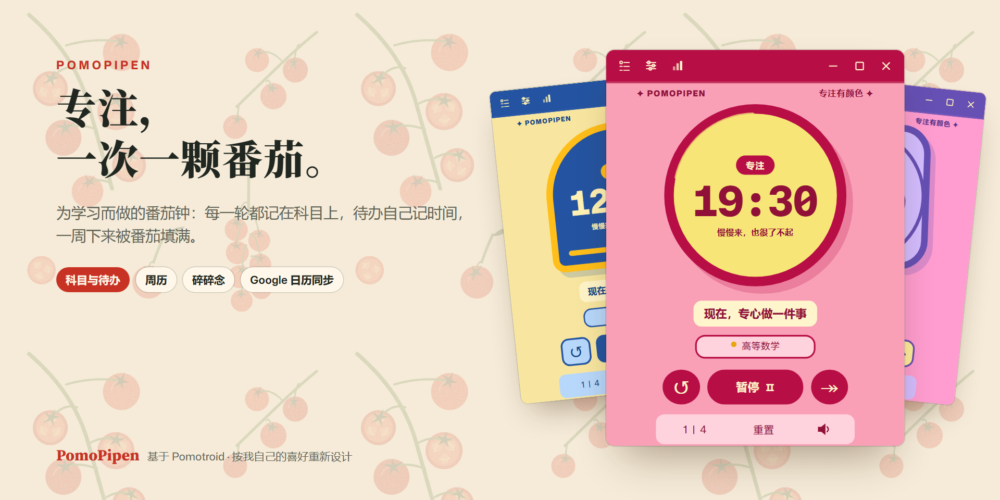
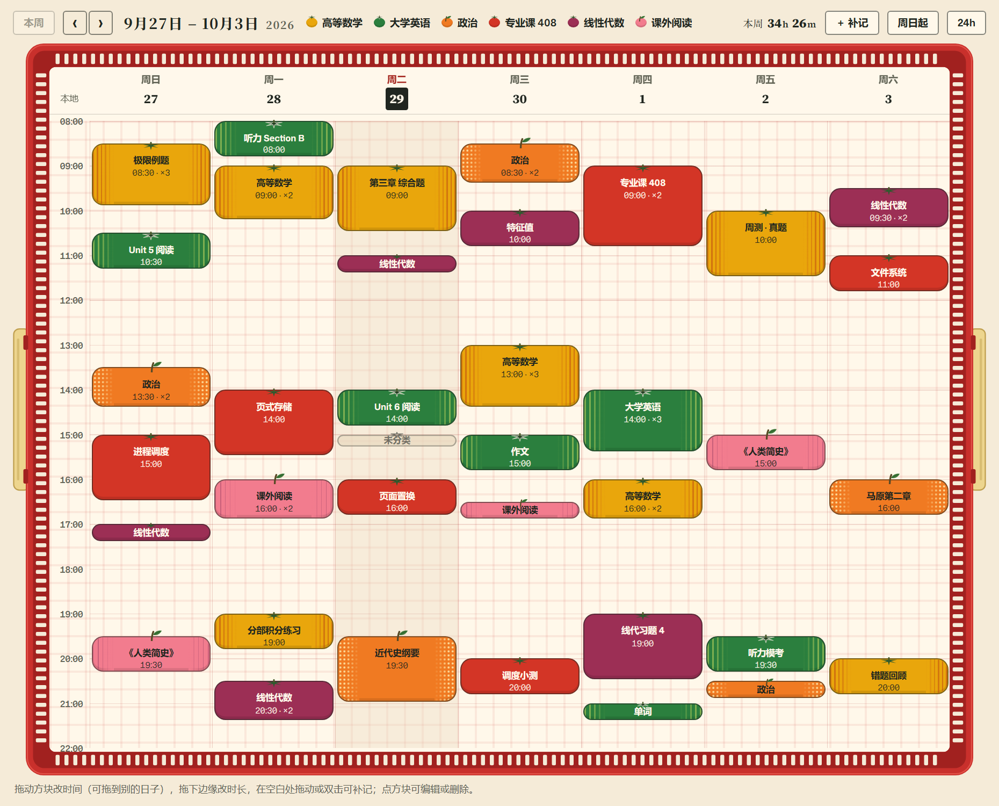
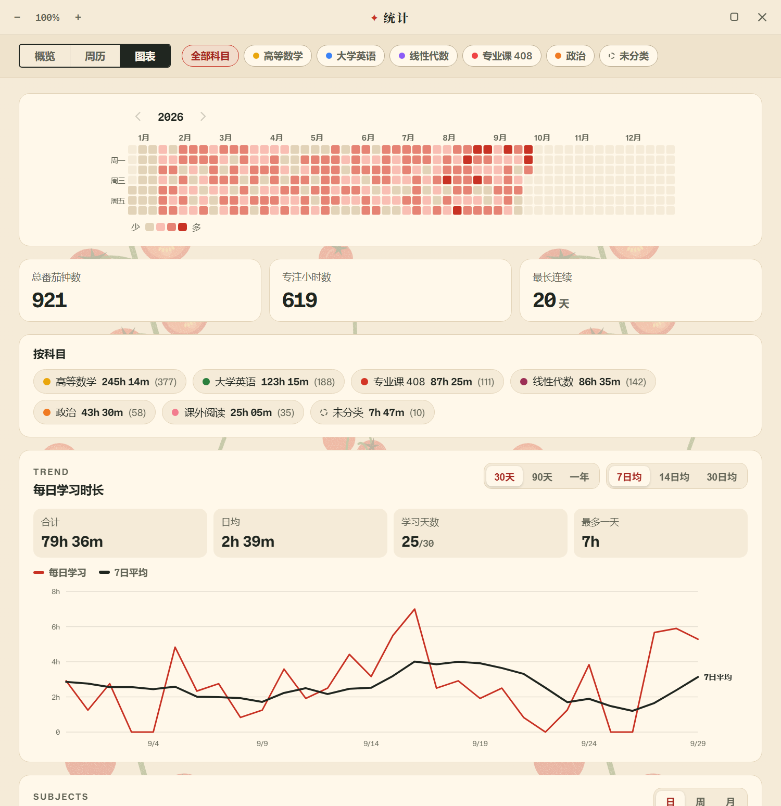
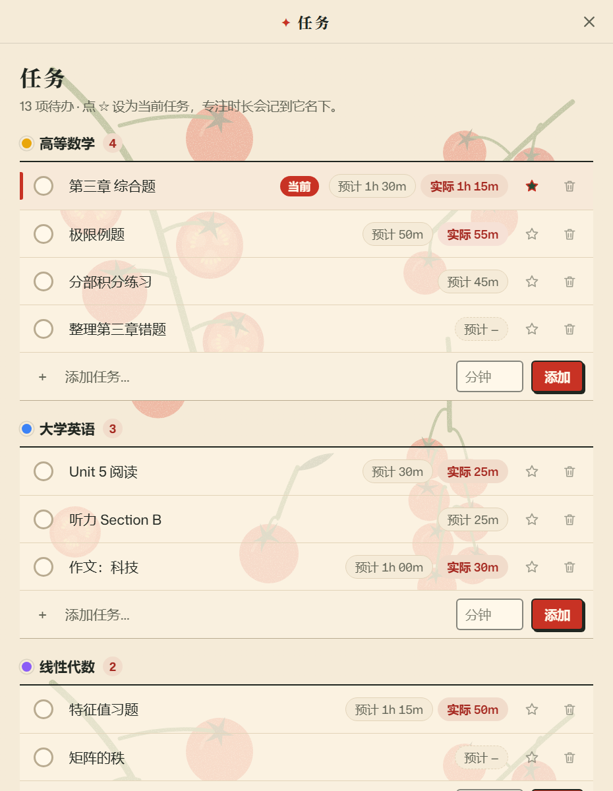
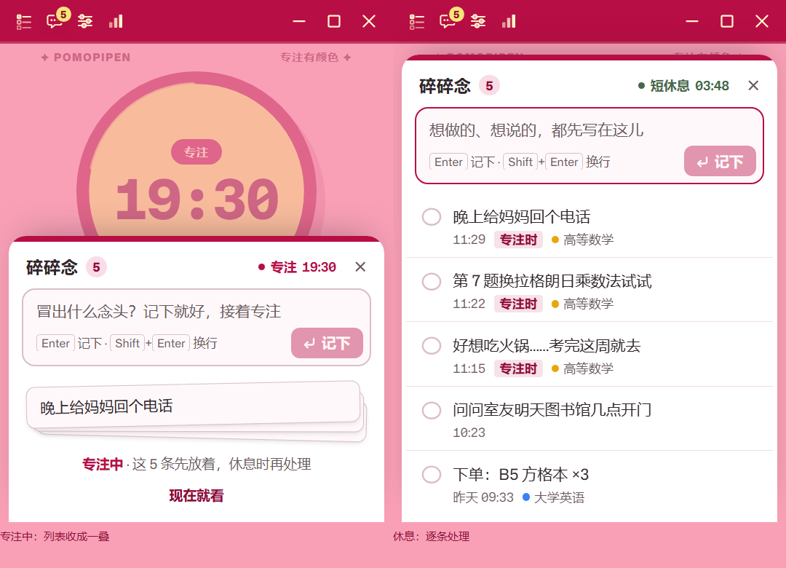
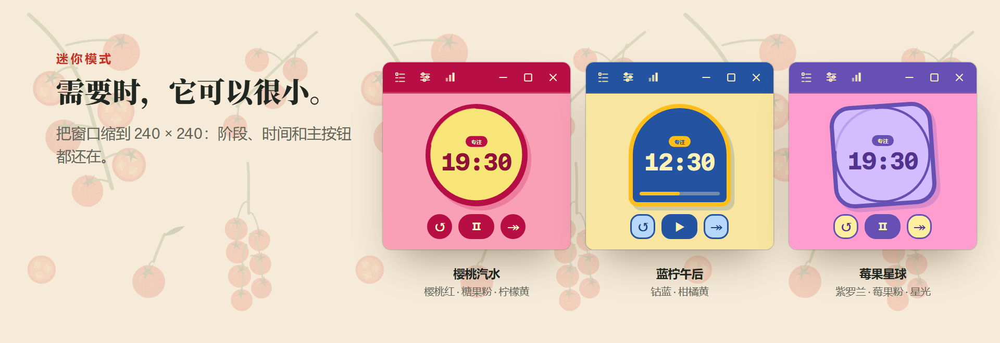
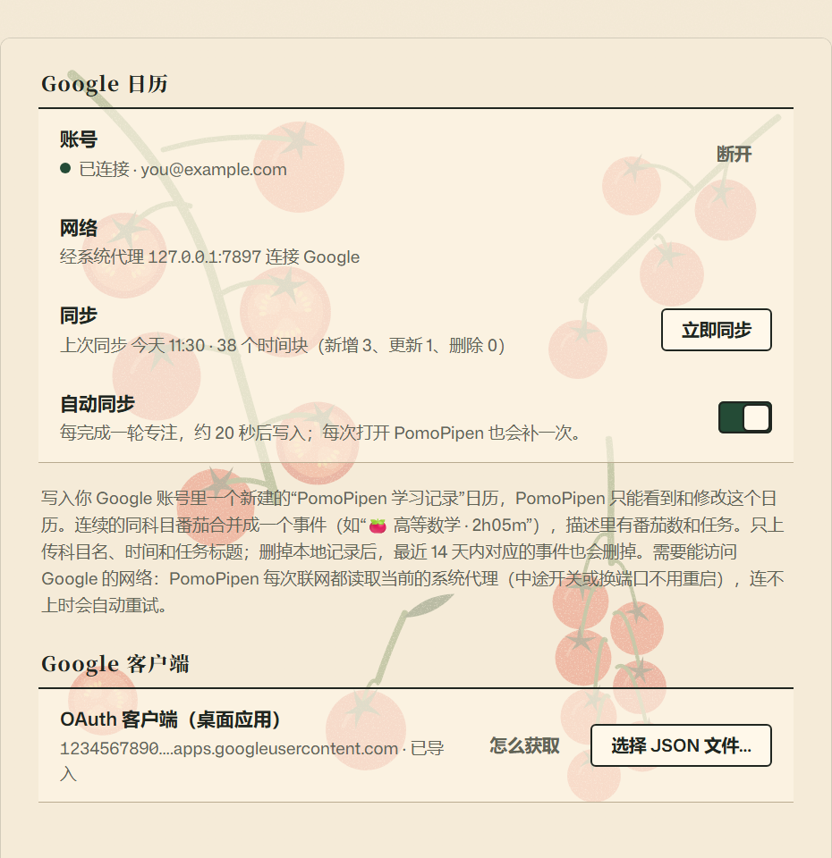

<p align="center">
  
</p>

<p align="center">
  <a href="README.md">English</a> · <b>简体中文</b> · <a href="README.ja.md">日本語</a>
</p>

PomoPipen 是我为自己学习做的番茄钟。它最初是 Christopher Murphy（Splode）的
[**Pomotroid**](https://github.com/Splode/pomotroid) 的一个分支：我保留了它稳定可靠的计时内核，
按自己的喜好重新设计了整个界面，并加上了我学习时真正需要的功能：科目、待办、周历、碎碎念和
Google 日历同步。

- **平台：** 目前只有 Windows（x64）版，欢迎移植到 macOS 和 Linux（见 [平台](#平台)）。
- **全部功能：** 见 [完整功能清单](#全部功能)。

> [!NOTE]
> PomoPipen 是个人项目，与 Pomotroid 官方无关。
> 原版应用的一切功劳归于 [Pomotroid](https://github.com/Splode/pomotroid)（MIT 许可证）。

## 和 Pomotroid 有什么不同

| | Pomotroid | PomoPipen |
|---|---|---|
| **外观** | 同一个表盘，38 套配色 | 4 套重新设计的主题，每套都有自己的表盘、字体和背景图案 |
| **科目** | — | 每一轮专注都记在当时学的科目上 |
| **待办** | — | 按科目分组的待办清单，预计用时和实际用时对照 |
| **统计** | 每日、每周和 52 周热力图 | 概览、可以手动编辑的周历、全年热力图、各科目合计、趋势图 |
| **没跑完的番茄** | 不计入 | 跳过或重置的一轮也计入学习时长（满 1 分钟）；进度每分钟保存一次 |
| **突然冒出的念头** | — | 碎碎念：现在记下，休息时再处理 |
| **日历** | — | 可选：单向同步到 Google 日历 |
| **数据安全** | — | 每次启动前先给数据库拍一次快照 |

## 一周，装满番茄

<p align="center"></p>

周历记录的是你实际专注的时间：每个方块从真实的开始时间画起，高度等于你坚持的时长；同一科目连续的几轮会合成
一个方块（`×3` 表示三轮）。拖动方块可以改时间，拖下边缘可以改时长，在空白处双击可以补记忘了计时的一轮。
在经典番茄主题里，每个科目都是一种番茄品种，装在一只菜篮里。每周可以从周日或周一开始。

## 统计

<p align="center"></p>

全年热力图、总轮数和总时长、最长连续天数、各科目用时，以及 30 天、90 天或一年的每日趋势（可叠加 7、14、30 天
平均线）。所有视图都能按科目筛选。

## 知道自己属于哪个科目的待办

<p align="center"></p>

待办按科目分组。点星标把某一项设为当前任务，之后每一轮专注都会记到它名下，你可以对比自己预计的时间和实际
花掉的时间。完成的待办会自动收起，可以撤销。

## 碎碎念：先记下，接着专注

<p align="center"></p>

专注到一半突然想起一件事？在计时器里按 <kbd>N</kbd>、点标题栏的对话气泡，或者在任何软件里按全局快捷键
<kbd>Ctrl</kbd>+<kbd>Alt</kbd>+<kbd>N</kbd>，记下来就回去继续学，计时不会暂停。专注时碎碎念会收成一叠纸条，
不打扰你；进入休息时 PomoPipen 会提醒一次：可以逐条划掉，也可以转成待办。

## 四套主题，还有迷你模式

<p align="center"></p>

经典番茄（默认）、樱桃汽水、蓝柠午后、莓果星球。切换主题不会打断正在进行的一轮。每套主题分别保存计时器和
周历的背景图。把窗口缩到 240 × 240，计时器仍然保留阶段、时间和主按钮。

经典番茄的计时器是一个刻度真的会转的机械厨房定时器（拧动刻度就能设定时间），也可以换成倒计时圆环里的一颗
真番茄。它的正式图片还没做好，所以这里暂时不展示。

## Google 日历同步（可选）

<p align="center"></p>

完成的专注会单向写进 PomoPipen 在你 Google 账号里新建的“PomoPipen 学习记录”日历。PomoPipen 只能看到和修改
这一个日历。同一科目连续的几轮合并成一个事件，只上传科目名、时间和任务标题。详见 [PRIVACY.md](PRIVACY.md)。

使用前需要在 Google Cloud 创建自己的 OAuth 客户端（桌面应用），然后在 设置 → 日历同步 里导入它的 JSON 文件。
详细步骤见 [docs/GOOGLE_CALENDAR.md](docs/GOOGLE_CALENDAR.md)。

## 全部功能

### 计时
- 番茄工作法循环：专注、短休息、长休息的时长，以及几轮后进入长休息，都可以调
- 可自动开始下一轮专注和/或休息；也可以完全关掉短休息或长休息
- 暂停、继续、重新开始、跳过、重置当前一轮
- 直接在计时器上设定时长：拧经典番茄的刻度、按方向键，或者直接输入分钟数（`30` 或 `25:30`，1–90 分钟）
- 没跑完的番茄也算数：跳过或重置的一轮专注，满 1 分钟的部分计入学习时长、周历、图表、任务用时和连续天数
- 进度每分钟保存一次，专注到一半退出程序，最多丢不到 1 分钟
- 计时器底部显示今天完成的番茄数
- 迷你模式：窗口可以缩到 240 × 240
- 窗口置顶，可设置休息时取消置顶
- 按下主按钮时有一声轻轻的“嗒”，可以关掉或换成自己的声音

### 科目
- 每一轮专注都记在一个科目上，在计时器上直接切换当前科目
- 科目颜色取自当前主题的色板；可改名、排序、归档、删除
- 经典番茄：每个科目都是一种番茄品种，可一键“换成最接近的品种”（可预览、可撤销）

### 待办
- 按科目分组，另有“未归类”
- 预计用时和实际专注时间并排显示
- 点星标设为当前任务，专注时间记到它名下
- 勾选完成可撤销，完成的待办自动收起

### 碎碎念（专注时随手记）
- 按 <kbd>N</kbd>、点标题栏的对话气泡，或用全局快捷键 <kbd>Ctrl</kbd>+<kbd>Alt</kbd>+<kbd>N</kbd> 打开
- 全局快捷键会把计时器叫到前面，记完后自动退回原样
- 专注时列表收成一叠纸条；进入休息时提醒一次
- 可以划掉、修改、删除（都能撤销），也可以转成任意科目下的待办
- 每条都记得写下的时间、是否在专注时写的、当时在学哪个科目

### 周历
- 专注方块按真实时间和时长显示；同一科目连续的几轮合成一块（`×N`）
- 拖动方块改时间（可以拖到别的日子），拖下边缘改时长
- 在空白处拖出一段或双击，补记忘了计时的一轮；点方块可以改日期、时间、科目和任务，或删除；每次改动都能撤销
- 没跑完的番茄颜色较淡
- 每周从周日或周一开始；24 小时视图
- 经典番茄：每个方块都是该科目品种的番茄，装在番茄篮边框里，透明度可调

### 统计
- 概览：今天的番茄数、专注时长、完成率、最近 7 天、当前连续天数、按小时分布
- 图表：GitHub 风格的全年热力图、总番茄数、总专注时长、最长连续天数、各科目用时
- 科目饼图，可看某一天、一周或一个月
- 30 天、90 天或一年的每日学习时长，可叠加 7、14、30 天平均线
- 按科目筛选
- 统计窗口可调大小、可缩放（<kbd>Ctrl</kbd> + 滚轮，<kbd>Ctrl</kbd> <kbd>+</kbd> / <kbd>−</kbd> / <kbd>0</kbd>）

### 主题与外观
- 四套主题：经典番茄、樱桃汽水、蓝柠午后、莓果星球；切换主题不会打断正在进行的一轮
- 经典番茄有两种计时器：刻度会转的机械厨房定时器，或倒计时圆环里的一颗真番茄
- 计时器和周历可以分别设置自己的背景图，按主题分开保存（JPG、PNG、WebP），可调透明度、“铺满照片”或“平铺图案”、图案大小
- 无缝平铺：PomoPipen 会找出图案的循环位置，从任意位置裁下的图案也能拼得没有接缝
- 经典番茄页面背景：番茄藤、品种图谱或素纸
- 可以用任意图片自定义应用图标
- 动画跟随系统的“减少动态”设置

### Google 日历同步（可选）
- 单向写入一个单独的“PomoPipen 学习记录”日历；应用只能看到这一个日历（`calendar.app.created` 权限）
- 每完成一轮专注约 20 秒后同步，每次启动也同步一次，也可以点“立即同步”
- 同一科目连续的几轮合成一个事件，描述里列出番茄数和任务
- 最近 14 天内的修改和删除也会同步
- 走系统代理，连接失败会自动重试

### 通知与声音
- 每轮结束时弹出系统通知
- 专注、短休息、长休息各有提示音，都可以换成自己的音频文件
- 专注和/或休息时可以开启滴答声，音量可调

### 快捷键
- 全局快捷键（窗口隐藏时也能用）：开始/暂停、重置、跳过、重新开始本轮、碎碎念
- 本地快捷键：暂停/继续、重置、跳过、音量加减、静音、全屏、碎碎念
- 点一下再按新组合键即可改键，冲突会在保存前提示

### 系统与数据
- 托盘图标实时显示进度圆弧；可最小化或关闭到托盘
- 所有数据都存在本地的 SQLite 数据库里
- 每次启动前自动给数据库拍快照（保留最近 10 次启动，外加最近 30 天每天一份）
- 可选的本地 WebSocket 服务，用于直播叠加层等外部集成
- 日志文件，一键打开日志文件夹，可开详细日志
- 界面支持英文和简体中文；Pomotroid 原有的西班牙语、法语、德语、日语、葡萄牙语、土耳其语翻译仍然保留，但只覆盖原版的界面

## 平台

PomoPipen 目前只支持 **Windows（x64）**，也只在 Windows 上构建和测试过。它和 Pomotroid 一样基于
[Tauri 2](https://tauri.app)，而 Pomotroid 能在 macOS 和 Linux 上运行，所以移植应该是可行的。欢迎 fork
源码、改成适合你自己系统的版本；如果跑通了，也非常欢迎提交 Pull Request。

## 从源码构建

需要 [Node.js 22](https://nodejs.org)、[Rust](https://rustup.rs)
和 [Tauri 2 的系统依赖](https://v2.tauri.app/start/prerequisites/)。

```bash
npm install
npm run tauri -- build --no-bundle --config src-tauri/tauri.stable.conf.json
```

生成的程序在 `src-tauri/target/release/pomopipen.exe`。直接运行 `npm run tauri dev` 或 `npm run tauri build`
得到的是单独的“PomoPipen Dev”版本，使用另一份数据。

> [!IMPORTANT]
> 经典番茄计时器用的照片目前只是占位图，所以没有放进这个仓库。正式图片加入之前，从源码构建的版本里这个计时器
> 会缺图。请先在 设置 → 外观 里换成樱桃汽水、蓝柠午后或莓果星球。

如果要用 Google 日历同步，也可以在构建前把 OAuth 客户端 JSON 放到 `src-tauri/google/client.json`（已被 git 忽略）。

## 隐私

你的学习记录只保存在自己电脑上（应用数据文件夹里的 SQLite 数据库）。PomoPipen 没有遥测，也没有服务器。
唯一会离开你电脑的数据，是可选的 Google 日历同步，说明见 [PRIVACY.md](PRIVACY.md)。

## 致谢

- [Pomotroid](https://github.com/Splode/pomotroid)，作者 Christopher Murphy（Splode），PomoPipen 的基础（MIT）。
- 使用 [Tauri 2](https://tauri.app)、[Rust](https://www.rust-lang.org) 和 [Svelte 5](https://svelte.dev) 构建。
- 字体：Mona Sans（GitHub）、Source Serif 4 和思源宋体（Adobe）、Noto Serif SC（Google），均采用 SIL Open Font
  License 1.1，见 [static/fonts/LICENSE.txt](static/fonts/LICENSE.txt)。

## 许可证

[MIT](LICENSE)。保留了 Pomotroid 原作者的版权声明；PomoPipen 的改动以同一许可证发布。
